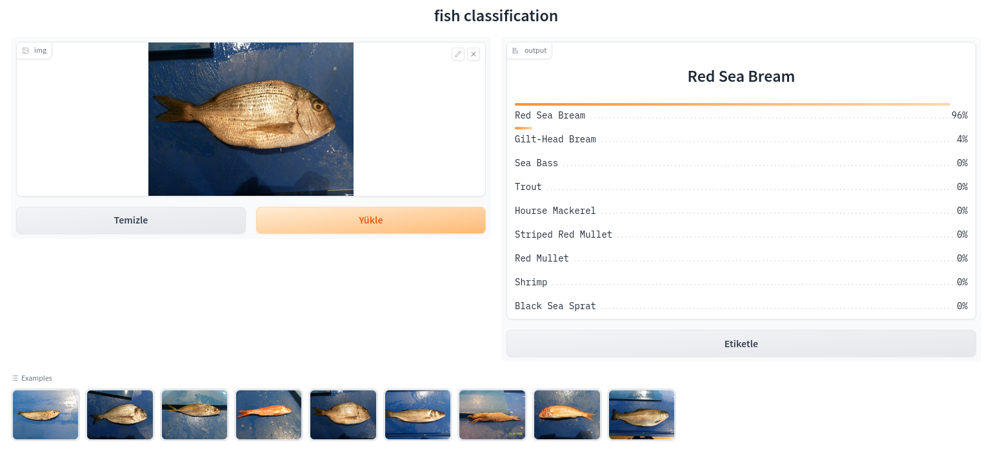

# Fish Project
This project involves the classification of eight different fish species and one shrimp species.

[Kaggle Dataset](https://www.kaggle.com/datasets/crowww/a-large-scale-fish-dataset)


## Running Gradio demo in docker

### Building docker image
```bash
docker build -t fish .

```
### Running docker image

```bash
docker run -p 7860:7860 fish

```

Now you open http://127.0.0.1:7860 address in your browser.



